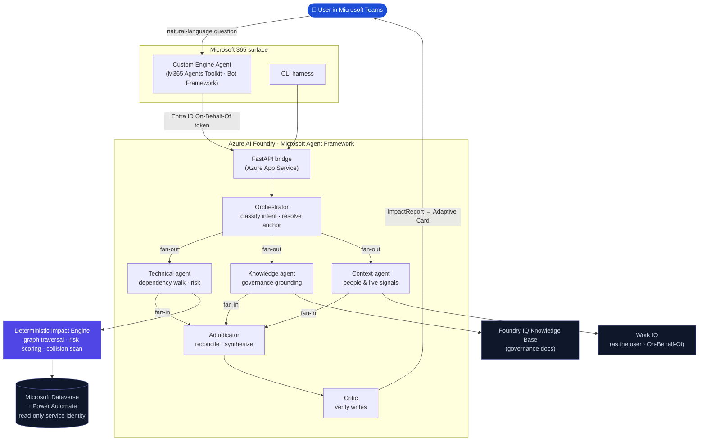

# Impact IQ: Architecture

Impact IQ answers two questions about a Microsoft Power Platform estate, *"what breaks if I change this?"* and *"why did this happen, and can you fix it?"*, by combining a **deterministic dependency engine** with a **multi-agent reasoning layer**, and delivering the result inside Microsoft Teams.

This document describes how the system is put together: its design principles, components, request flow, and security model.

---

## Design principles

1. **Deterministic core, agentic reasoning.** The dependency walk, risk scoring, and change-collision scan run in plain Python over a graph. The language models *call* these as tools and reason about their output. Agents never infer dependencies in tokens, so the blast radius is grounded in fact rather than guessed.
2. **Two identities, by scope.** A broad, **read-only** service identity reads *structure* (metadata, flows, roles, dependencies). A **delegated per-user** identity reads *content* (records, work signals) and performs any writes. Content is never read with the service identity.
3. **Comprehension ≠ disclosure.** The system may read broadly to compute true impact, but it governs what it *reveals*. Confidential signals surface as existence + routing only, and the data contracts structurally cannot carry sensitive substance.
4. **Bounded, confirm-before-write mutations.** The only writes to customer data are per-record, diagnosis-grounded corrective fixes, executed under the user's identity behind an explicit confirmation and recorded in an append-only audit log.
5. **Draft-only outbound.** Every outbound message is drafted and shown for confirmation; nothing is sent on inference alone.

---

## System overview



---

## Components

### Surfaces

- **Teams Custom Engine Agent**: a thin TypeScript surface built with the Microsoft 365 Agents Toolkit (Bot Framework hosting). It owns the conversation, signs the user in, renders Adaptive Cards, and forwards each turn to the bridge. It holds no analysis logic of its own.
- **CLI**: a local harness that runs the same pipeline end to end for development and scripted use.

Both surfaces call the **bridge**; the bridge is where all analysis, the write gates, and the audit chain live.

### Bridge (FastAPI)

A FastAPI service that exposes the agent pipeline over HTTP. Because a full analysis can take longer than a single chat turn, the bridge runs each request as a background **job**: the surface launches the job, receives a job id, and polls for the result. The bridge also enforces a shared-secret guard between surface and bridge, threads the per-user token through to the On-Behalf-Of flow, and owns the confirm-before-write endpoints.

### Orchestration (Microsoft Agent Framework)

The multi-agent pipeline is a Microsoft Agent Framework workflow with genuine fan-out/fan-in edges and parallel execution. Each node internally runs a hardened Azure AI Foundry prompt-agent loop, so the knowledge and work-signal integrations and their retry/consent handling are inherited unchanged.

| Agent | Responsibility | Tools it owns |
|---|---|---|
| **Orchestrator** | Classifies intent (diagnose vs. validate), resolves the anchor component, decides which specialists to dispatch | anchor + URL resolution |
| **Technical** | Walks the dependency graph, scores risk, inspects flows and permissions, scans recent edits | the deterministic engine (13 tools) |
| **Knowledge** | Grounds the verdict in the organization's governance documents | Foundry IQ knowledge base |
| **Context** | Surfaces owners and live human signals: who is affected, who is already changing the same thing | Work IQ (as the user) |
| **Adjudicator** | Reconciles the specialists' findings, including disagreements, into a single report and artifact | artifact validation |
| **Critic** | Adversarially verifies anything that proposes a write or flags a collision, before it reaches the user | (conditional gate) |

The specialists run **in parallel** and are isolated from one another; each returns a typed finding. The adjudicator consumes whatever subset ran and produces one business-language `ImpactReport`.

### Deterministic impact engine

The trust anchor. Built on a `networkx` directed multigraph of the estate.

- **Graph model**: nodes are estate components (tables, columns, flows, views, security roles, business rules, plug-ins, environment variables); edges carry typed relations (writes-to, reads-from, references, triggered-by, secured-by, surfaces, mandatory-on, has-column, …).
- **Dependency walk**: the engine's primary move on every anchor: a bidirectional, depth-bounded, ranked traversal of the dependency neighbourhood, built on Dataverse's own dependency APIs (`RetrieveDependentComponents`, `RetrieveRequiredComponents`, `RetrieveDependenciesForDelete`).
- **Causal vs. structural partitioning**: the neighbourhood is split so that components merely *contained* near the anchor (sibling columns, solution members) are not miscounted as *impacted*. This keeps the blast radius honest.
- **Risk score (0 to 100)**: a weighted, explainable score over the causal downstream count, affected teams, flows writing to the target, mandatory-field changes, managed-layer conflicts, and active change collisions. Every contribution is recorded so the score can be explained, not just emitted.
- **Change-collision scan**: fuses the estate's "recently changed" signal with Work IQ's "actively being worked on" signal to surface collisions that appear on no single screen.
- **Permission diagnosis**: resolves whether an apparent failure is actually an access gap (role, field security, or row ownership) rather than a defect.

### Grounding: the IQ stack

- **Foundry IQ** is the governance brain. A knowledge base over the organization's policy and standards documents is attached to the Knowledge agent; it returns grounded passages with citations, letting the agent decide whether an observed behaviour is a defect or *expected per policy*.
- **Work IQ** is the situational awareness. Reached as a peer agent over the agent-to-agent protocol and always run **as the signed-in user**, it surfaces owners and live work signals across Microsoft 365, honouring every permission, sensitivity label, and information barrier upstream.

### Report, artifacts & cards

The adjudicator emits a typed `ImpactReport` (verdict, risk, impacted components, affected teams, citations, and an optional artifact). A post-processing **verdict gate** validates groundedness (dropping uncited claims, stripping unverified owner names, enforcing change-control dominance). The report is rendered as an **Adaptive Card** for Teams; any artifact (a draft message, a record fix, a cross-team handoff) is shown as a preview and never executed without confirmation.

---

## Request lifecycle

**Validate: "what breaks if I change this?"**

1. Resolve the proposed change to an anchor component.
2. Walk the dependency neighbourhood to compute the blast radius.
3. Search for existing equivalents (reuse vs. build).
4. Intersect the blast radius with recently-edited components and live work signals (collision detection).
5. Reconcile into a build/reuse/extend verdict with a risk score and, where it crosses team boundaries, a draft handoff.

**Diagnose: "why did this happen, and can you fix it?"**

1. Anchor on the symptom or component.
2. Walk the neighbourhood to produce the complete suspect population.
3. Enrich with flow run history, audit, field-security, and role-privilege reads scoped to what the walk surfaced.
4. Ground the verdict against governance documents (defect vs. expected).
5. Produce the cause, impact, and interim actions and, where appropriate, a bounded, confirm-before-write fix.

In both flows the orchestration is the language model's job; the dependency walk, scoring, and collision scan are the engine's.

---

## Identity & security model

- **Service identity (read-only).** A custom Dataverse role with no create/write/delete privileges. Used only to read structure. A startup self-check fails loudly if the role ever holds a write privilege.
- **Delegated identity (On-Behalf-Of).** Each user's Teams sign-in is exchanged, via Microsoft Entra On-Behalf-Of, for tokens scoped to the downstream services. All content reads, work-signal reads, and writes run as that user, so existing permissions apply automatically.
- **Bounded writes.** Mutations to customer data are limited to per-record, diagnosis-grounded corrective fixes: repair a record, create the single row a failed automation never wrote, or resubmit a failed flow run. Each requires an explicit confirmation (a tap for diagnosis-grounded changes, typed confirmation for document-grounded ones), is gated on confidence, and is audit-logged with a before/after preview. Bulk changes become a reviewable blueprint rather than an automatic "fix all."
- **Structural flow repair (sandbox only).** Repairs to the flows or tables themselves are confined to a dedicated sandbox environment, are fix-only, role-gated, and capture before-images. The analysis environment stays read-only.
- **Draft-only outbound.** All messages are drafted and confirmed before sending.
- **Comprehension ≠ disclosure.** A two-tier disclosure gate ensures confidential signals surface as existence + routing only; the contracts cannot carry the sensitive substance, and the gate fails closed.
- **Audit chain.** Every executed write records the diagnosis, the preview, the confirmation type, the resulting change id, and any source span, append-only and queryable.

---

## Technology stack

| Layer | Technology |
|---|---|
| Agent runtime | Azure AI Foundry (Foundry Agent Service, prompt-agent runtime) |
| Orchestration | Microsoft Agent Framework (`agent-framework-core`): workflow fan-out/fan-in |
| Governance grounding | Foundry IQ knowledge base (over Azure Blob), attached via MCP |
| Human signal | Work IQ (agent-to-agent, On-Behalf-Of) |
| Estate of record | Microsoft Dataverse + Power Automate Web APIs (read-only) |
| Surface | Microsoft 365 Custom Engine Agent (M365 Agents Toolkit + Bot Framework) in Microsoft Teams |
| Identity | Microsoft Entra ID: client credentials (service) + On-Behalf-Of (delegated) |
| Hosting | Azure App Service (Linux) |
| Core libraries | Python 3.12 · FastAPI · `networkx` · Pydantic · `azure-ai-projects` · `azure-identity` · `azure-search-documents` · `@microsoft/agents-hosting` |

---

## Repository layout

```
src/impactiq/
  connectors/   read-only estate readers (Dataverse, Power Automate, Solutions)
  graph/        deterministic impact engine (build · traverse · risk · collisions · permissions)
  agents/       multi-agent orchestration (orchestrator · specialists · adjudicator · critic)
                + grounding: Foundry IQ knowledge base (MCP tool) + Work IQ (workiq.py)
  report/       ImpactReport schema · Adaptive Card · verdict gate · artifacts
  builder/      sandbox-only fix executor (gated, fix-only, before-images)
  server.py     FastAPI bridge
  cli.py        local end-to-end harness
surface/        Microsoft 365 Custom Engine Agent (Teams)
evals/          labelled scenario corpus + graders
tests/          unit tests (deterministic engine fully covered, no model calls)
```

