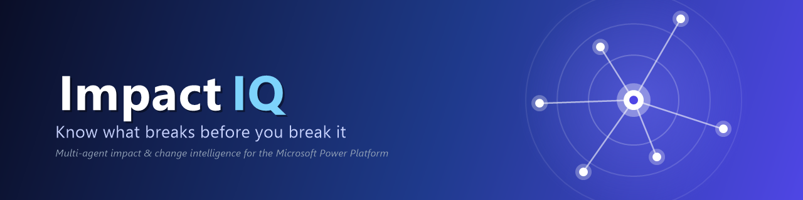
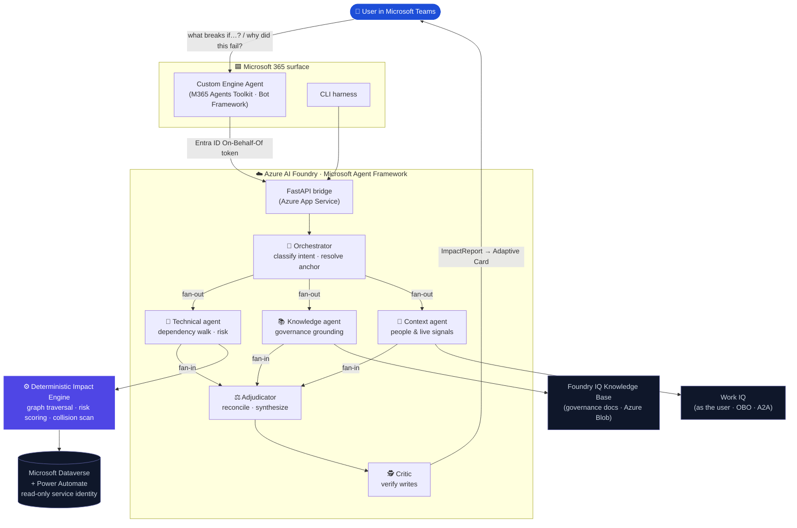

<div align="center">



# Impact IQ

### Before you fix it or build it, ask ImpactIQ.

**Your always-on business analyst for the Microsoft Power Platform.** A multi-agent assistant built on **Azure AI Foundry**, the **Microsoft Agent Framework**, and Microsoft's **IQ** stack (**Foundry IQ** + **Work IQ**). It handles the impact analysis, root-cause investigation, and cross-team coordination that used to take a week of meetings. Delivered as a **Microsoft 365 Copilot** Custom Engine Agent in **Microsoft Teams**.

<br/>


<br/>


**🏆 Microsoft Agents League @ AI Skills Fest:** _Enterprise Agents_ challenge · also targeting **Best Use of IQ Tools**

[▶️ **Watch the demo**](https://youtu.be/bsYYsmVG5CI) · [Architecture](https://github.com/shimonjose/ImpactIQ/blob/main/ARCHITECTURE.md) · [Safety model](#-safety-by-design) · [Get started](#-get-started)

</div>

---

<div align="center">

### _Your business analyst, minus the meetings._

**Built for bigger ideas. Understood in seconds.**  •  **The blast radius, before the blast.**  •  **Diagnosis to done in minutes, powered by IQ.**

</div>

---

## 🧠 What is Impact IQ

Across every business, people now build their own flows, apps, and automations on the Power Platform: fast, often in **silos**, and with no idea what the rest of the organization depends on. **Impact IQ** changes that. It's a multi-agent assistant that walks your **real Microsoft Dataverse dependency graph** and tells *anyone*, whether a business user or an admin, exactly what breaks **before** they change it. When something has already broken, it traces the root cause and proposes a precise, **per-record** fix. No ticket. No waiting on a developer.

It runs where your team already works: **Microsoft Teams**, as a **Microsoft 365 Copilot Custom Engine Agent**. It grounds every verdict in your own governance documents via **Foundry IQ**, surfaces the human signal via **Work IQ**, and **never guesses a dependency**. A deterministic engine does the graph traversal in code, so the agents reason about *consequences*, not about whether the edges are real.

> **Two questions every maker and admin faces. Hours of manual investigation each. Now answered in minutes, right inside Microsoft Teams.**
>
> 1. 🔮 **"What breaks if I change this?"** Impact analysis: walk the blast radius of a proposed change to a column, flow, view, security role, or business rule, ranked by risk.
> 2. 🔧 **"Why did this happen, and can you fix it?"** Incident diagnosis & remediation: trace why an automation failed or data looks wrong, then propose a bounded, confirm-before-write fix.

🧠 **The "IQ" in Impact IQ is literal and load-bearing.** The reasoning runs on **Azure AI Foundry**, but the *intelligence* is Microsoft's **IQ** stack: **Foundry IQ** grounds every verdict in *your* governance, and **Work IQ** reads the human signal across Microsoft 365. Take them out and you're left with a dependency list. ([Why IQ is the core ↓](#-powered-by-iq))

---

## 😰 The problem

Across modern organizations, **business users build their own automations**, such as a flow to route approvals, an app to track requests, or a rule that stamps a field. It's fast and empowering, but it happens in **silos**. No one person can see how the pieces connect, and the platform won't show you the whole chain: tables, columns, cloud flows, views, security roles, business rules, and plug-ins all depend on each other invisibly.

So two things go wrong, constantly:

- **When something breaks**, the person who hit it usually can't diagnose it. They file a ticket and **wait for a developer** to dig through run histories, audit logs, and Teams threads, while the business stays blocked.
- **When someone has a new idea**, they build blind, rebuilding something that already exists, breaking a downstream automation they never knew about, or **colliding with another team that's mid-change on the same data**.

The cost of a miss is a **silent production failure**. And the hardest signal of all, *who else is already changing the same thing*, lives in Teams chats and draft specs, on **no screen anywhere**.

---

## 🧑‍💼 The business analyst that never sleeps

Think about what it takes to safely change anything in a shared Power Platform estate today. You book a meeting with the owner. You ping the dev who built the flow. You email three teams to ask *"are you still using this?"* You hunt down the policy that governs it. You write up an impact assessment. **That's days of a business analyst's calendar for one change.**

Impact IQ does that entire job in a single Teams message:

| The BA work | Who used to do it | How Impact IQ does it |
|---|---|---|
| 🔍 **Discovery:** what exists, what depends on what | Hours clicking through solutions | The deterministic engine walks your **real** Dataverse graph |
| 📚 **Governance check:** allowed? a defect or expected? | A meeting with the policy owner | **Foundry IQ** reads your policies & SOPs |
| 🤝 **Coordination:** who's affected, who's mid-change, who to loop in | Owner syncs + *"are you using this?"* threads | **Work IQ** reads the room across Teams & Outlook |
| 🧾 **The write-up:** impact assessment, risk, handoff | A document, by hand | Generated for you, in business language, on an Adaptive Card |

**No meetings. No chasing owners. No waiting on a dev.** The analysis that used to anchor a week of back-and-forth arrives before your coffee's cold, and the judgment behind it comes straight from the **IQ** stack.

---

## 👥 Who wins

Impact IQ isn't just for platform admins. **Everyone who builds, runs, or governs automation gets a win.**

| You are… | Today | With Impact IQ |
|---|---|---|
| 🙋 **Business user / maker** | Build in a silo; wait on a developer when something breaks | **Self-serve:** see what already exists, what your change will affect, and a suggested fix, before you ever raise a ticket |
| 🛡️ **Admin / governance** | Manual dependency archaeology before every change | A **ranked, explainable blast radius** in minutes, with collision warnings |
| 👩‍💻 **Developer / IT** | Flooded with vague "it's broken" tickets | Users arrive with **root cause + impact already identified**, so you triage, not investigate |

---

## 🔧 It doesn't just diagnose, it fixes

Most tools stop at *"here's what's wrong."* **Impact IQ closes the loop.** It diagnoses the cause (the deterministic engine + **Foundry IQ**), then proposes the actual fix and executes it the moment you approve. Every fix is **bounded, per-item, confirm-before-write, runs under your own identity, and is fully audit-logged.**

| Fast fix | What it does | Guardrail |
|---|---|---|
| 🩹 **Repair a record** | Writes the missing or wrong value the failed automation should have set | Per-record · diagnosis-grounded · **tap** to confirm |
| ➕ **Create the missing row** | Creates the *one* record a broken flow never wrote | Per-record · **typed** confirm · values only from the failed run's own evidence |
| 🔁 **Resubmit a failed flow run** | Re-runs the exact Power Automate run that failed, once the cause is fixed | One run per **tap** · your own flow permissions |
| 🛠️ **Fix the flow itself** | Repairs the broken cloud flow (or table) in a dedicated **sandbox** environment | Fix-only · role-gated · before-images · never touches the live estate |

> _Diagnosis to done, without a single hand-off to IT._

The bigger the change, the higher the bar: a single data value is a **tap**; a document-grounded value needs a **typed** confirm; structural flow repairs are quarantined to a **sandbox** the agent is code-enforced to keep separate from your live environment. **Nothing is ever changed on inference alone.**

---

## ⚡ Minutes, not hours

> **Observed in hands-on pilot testing against a live Dataverse estate. Illustrative, not a lab benchmark.**

| Task | Manual today | With Impact IQ | What it means |
|---|---|---|---|
| 🔮 **Impact analysis** (new idea / proposed change) | **2-4 hours** of investigation | **~minutes** | A ranked, explainable blast radius instead of click-through archaeology |
| 🔧 **Incident diagnosis + fix** (failed flow / bad data) | **1-2 hours** incl. coordination, back-and-forth, investigation, the fix | **~minutes** | Root cause **+** a previewed per-record fix in one loop |

**Derived (illustrative) figures: extrapolated from the two datapoints above, not measured benchmarks:**

- ⏱️ **~90-95% reduction** in hands-on time per task (≈3 hr average → under ~10 min).
- 📅 **~13-17 hours saved per person per week** for anyone running ~5 impact checks + ~3 incident triages weekly *(5×3 hr + 3×1.5 hr ≈ 19.5 hr collapses to under ~3 hr)*.
- 🛡️ **One avoided silent production break** can outweigh the entire time saving. The failure you *didn't* ship is the real ROI.
- 🗓️ **The coordination overhead disappears.** The owner syncs, dev pings, and *"are you using this?"* threads a change used to need are answered up front by **Work IQ**.

---

## 🎬 See it in action

> ▶️ **[Watch the demo video](https://youtu.be/bsYYsmVG5CI)** _(≤ 5 min)_

<!-- After recording, drop a short GIF at assets/demo.gif and uncomment:

-->

A typical turn in Teams:

1. **You ask**, in plain language: *"What breaks if I make `Request.status` mandatory?"*
2. Impact IQ signs you in with **Microsoft Entra ID** (On-Behalf-Of), classifies the intent, and resolves the anchor component.
3. Three specialist agents run **in parallel**: dependencies, governance, people.
4. You get a **business-language verdict** on an **Adaptive Card**: the ranked blast radius, the risk score with reasons, governance citations, who to coordinate with, and any draft message or fix. **Nothing sent or written without your explicit confirmation**.

---

## 🏗️ Architecture

Impact IQ is a true multi-agent system on **Azure AI Foundry**, orchestrated with the **Microsoft Agent Framework (MAF)**. An **Orchestrator** classifies intent and resolves the anchor, then fans out to **three specialist agents in parallel**; an **Adjudicator** reconciles their findings, including disagreements, into a single `ImpactReport`, and a **Critic** verifies anything that proposes a write.

> 📐 Deeper design detail: components, data flow, and the full security model live in **[ARCHITECTURE.md](ARCHITECTURE.md)**.



### The agent team

| Agent | Role | Owns |
|---|---|---|
| 🧭 **Orchestrator** | Classifies intent (`DIAGNOSE` / `VALIDATE`), resolves the anchor, decides who to dispatch | `resolve_anchor`, `resolve_url` |
| 🔧 **Technical** | Walks the dependency graph, scores risk, inspects flows & permissions, scans recent edits | The **deterministic engine** (13 tools) |
| 📚 **Knowledge** | Grounds the verdict in org governance: *"is this a defect, or expected per policy?"* | **Foundry IQ** Knowledge Base (MCP) |
| 🤝 **Context** | Surfaces owners and **live human signals**: who's affected, who's already changing the same thing | **Work IQ** (as the user, OBO) |
| ⚖️ **Adjudicator** | Reconciles all findings into one business-language `ImpactReport` + artifact | `validate_artifact` |
| 🕵️ **Critic** | Adversarial verify-and-repair on any write or collision before it reaches you | (gate, conditional) |

> **Realized as a hybrid** (Microsoft Agent Framework **1.8.1**): MAF provides the genuine `WorkflowBuilder` fan-out/fan-in graph with **verified parallel execution**, while each node runs a hardened **Azure AI Foundry prompt-agent loop**, so Foundry IQ (MCP), Work IQ (A2A + consent gate), and 5xx/429 retries are inherited unchanged.

### Request lifecycle

```
intent → anchor → [ dependency walk ‖ governance retrieval ‖ human-signal scan ] → reconcile → risk → artifact → Adaptive Card
        (LLM)     (deterministic)    (Foundry IQ)         (Work IQ)              (LLM)    (det.)   (gated)
```

---

## ⚙️ The trust anchor: a deterministic impact engine

The single most important design decision: **agents never derive dependencies in tokens.** The dependency walk, risk scoring, and collision scan are **plain Python over a `networkx` graph**. The LLMs *call* the engine and reason about its output. That's what makes the blast radius *trustworthy* rather than plausible.

- **Dependency walk:** bidirectional, depth-bounded, ranked, on **every** anchor kind (column, flow, view, role, business rule, plug-in, environment variable), via Dataverse's own `RetrieveDependentComponents` / `RetrieveRequiredComponents` / `RetrieveDependenciesForDelete`.
- **Causal vs structural:** the engine partitions the neighbourhood so *"add a sibling column to Contact"* reports **3 impacted and 310 structural (not counted)**, not a scary, wrong "313 impacted." Honest, defensible reasoning.
- **Explainable risk score (0-100):** weighted over causal downstream count, affected teams, flows writing to the field, mandatory-field changes, managed-layer conflicts, and **active change collisions**. Every contribution is recorded in `reasons[]`.
- **Change-collision detection:** fuses Dataverse "recently changed" with Work IQ "actively being worked on" to surface the collision **no screen shows you**: a teammate mid-change on the same table.

---

## 🧠 Powered by IQ

**This is the intelligence that turns a dependency viewer into a business analyst. It's load-bearing, not decorative.** The deterministic engine gives Impact IQ the *facts* (the real dependency graph). Microsoft's **IQ** stack gives it *judgment* and *awareness*, and without them, the headline capabilities simply don't exist.

### 📚 Foundry IQ: the governance brain
A raw dependency answer can only say *"these things are connected."* **Foundry IQ** lets Impact IQ say *"…and per your close-request SOP, re-stamping this field is **prohibited**, so this isn't a defect, it's expected behaviour"*, with a citation to the exact page. No Foundry IQ → no governance verdict, no defect-vs-expected reasoning, no grounding. It's the difference between *data* and a *decision*.

### 🤝 Work IQ: the situational awareness
The hardest question in change management, *who else is already touching this?*, has no answer on **any screen in the platform.** It lives in Teams chats, Outlook threads, and half-finished work. **Work IQ** is the only way Impact IQ can see it, and it powers **change-collision detection** (*"coordinate with Priya because she's mid-change on this table"*) and the **affected-people sweep**. No Work IQ → no collision detection, and the coordination meetings can't be replaced because the very thing they exist *for* would be invisible. And because Work IQ runs **as the signed-in user**, it honours every Microsoft 365 permission, sensitivity label, and information barrier automatically.

> **Remove the IQ stack and Impact IQ degrades from a business analyst to a dependency lister.** That's why **Foundry IQ** and **Work IQ** are first-class specialist agents here, two of the three perspectives behind every answer, not bolt-ons.

---

## 🛡️ Safety by design

> _Powerful enough to fix your data. Bounded so it never does anything you didn't confirm._

Impact IQ runs today in a real production **Microsoft 365 tenant**, so trust is structural, not promised:

- **Two identities, by scope.** A broad **read-only service identity** (a custom Dataverse role with **zero** Create/Write/Delete privileges) reads *structure*; a **delegated per-user identity** (Microsoft Entra **On-Behalf-Of**) reads *content* and makes writes. Content is **never** read as the service identity. `cli whoami` **fails loudly** if the service role holds any write privilege.
- **Bounded writes only.** The *only* path that mutates customer data is a `DIAGNOSE`-grounded, **data-only**, **per-record** corrective fix, under the user's identity and behind an **explicit per-write confirmation** (tap for diagnosis-grounded, **typed** for document-grounded), gated on confidence ≥ 0.8. Bulk fixes become a reviewable blueprint, never an auto-"fix all." No configuration, schema, or service-identity writes, ever.
- **Draft-only outbound.** Every message (Teams intro, cross-team manager handoff) is **draft / confirm-before-send**, never sent on inference.
- **Comprehension ≠ disclosure.** It reads broadly to compute true impact but governs what it reveals: a two-tier disclosure gate means confidential signals surface as **existence + routing only**, fail-closed, with confidentiality enforced *structurally* (the contract literally cannot carry the sensitive substance).
- **Full audit chain.** Every executed write logs diagnosis id + preview + confirmation type + change id + source span. It is append-only and queryable.

---

## 🏆 Why Impact IQ wins


| Criterion | How Impact IQ delivers |
|---|---|
| **Deterministic** | A deterministic graph engine walks the **real** Dataverse dependency edges. Agents never hallucinate dependencies, so the blast radius is grounded in fact, not inference; **Foundry IQ** then grounds the verdict in *your* real governance docs, with citations. |
| **Multi-step Reasoning** | A genuine **Microsoft Agent Framework** workflow: orchestrator → parallel specialists → adjudicator → critic. It reasons across the dependency walk, governance (**Foundry IQ**), and human signal (**Work IQ**). **Disagreement is a feature**: the adjudicator visibly flips a verdict from "defect" to "expected per policy" with a citation. |
| **Reliable & Safe** | Read-only service identity, delegated per-user writes, per-record confirm-before-write, draft-only sends, fail-closed disclosure, full audit chain, backed by **259 deterministic tests** with no LLM in the loop. |
| **Access** | **Democratizes** impact analysis. It turns a job that used to need a developer into one question anyone asks in Teams; pairs forward-looking *what-if* with backward-looking *why*, then **closes the loop with a bounded fix**; detects change collisions invisible on any screen. |
| **Simple User Experience** | Lives inside **Microsoft Teams** as a Microsoft 365 Copilot Custom Engine Agent. Plain-language answers appear on **Adaptive Cards** that a business user understands *without* a developer, plus a CLI for power users. |

> 🥇 **Best Use of IQ Tools:** both of Microsoft's IQ surfaces are first-class agents here: **Foundry IQ** (governance brain) and **Work IQ** (situational awareness). They are not bolt-ons, but the core of what makes the verdict trustworthy and the coordination automatic.

---

## 🧱 Built with

| Layer | Microsoft technology |
|---|---|
| **Agent runtime** | **Azure AI Foundry**: Foundry Agent Service, prompt-agent runtime (`PromptAgentDefinition` + Responses API) |
| **Orchestration** | **Microsoft Agent Framework** `1.8.1`: `WorkflowBuilder`, fan-out/fan-in edges, `@executor` |
| **Governance grounding** | **Foundry IQ**: Knowledge Base over Azure Blob, attached via MCP, gpt-4.1 query planning |
| **Human signal** | **Work IQ**: A2A peer-agent over On-Behalf-Of (honors M365 permissions, sensitivity labels, info barriers) |
| **Estate of record** | **Microsoft Dataverse** + **Power Automate** Web APIs (read-only) |
| **Surface** | **Microsoft 365 Copilot Custom Engine Agent** via the **Microsoft 365 Agents Toolkit** + Bot Framework, in **Microsoft Teams** |
| **Identity** | **Microsoft Entra ID**: client-credentials (service) + On-Behalf-Of (delegated) |
| **Hosting** | **Azure App Service** (Linux): Python bridge + Node surface |
| **SDKs** | `azure-ai-projects 2.2.0` · `azure-identity 1.25.3` · `azure-search-documents` (Knowledge Bases preview) · `@microsoft/agents-hosting` |
| **Core** | Python 3.12 · FastAPI · `networkx` · Pydantic · `@azure/identity` |

---

## 🚀 Get started

### Prerequisites
- Python **3.12**, an **Azure AI Foundry** project, a **Microsoft Dataverse** environment, and (for Work IQ) a **Microsoft 365 Copilot** license.
- Two **Microsoft Entra ID** app registrations: a read-only service identity (structure) and a delegated middle-tier for On-Behalf-Of (content + writes). See [.env.example](.env.example) for the full set of configuration values.

### Run locally (CLI)
```powershell
python -m venv .venv
.\.venv\Scripts\Activate.ps1
pip install -e ".[foundry,agents,surface,dev]"

copy .env.example .env      # fill values locally; never commit secrets

cli whoami                          # config + read-only privilege audit
cli dump-estate --solution "<name>" # read the estate (read-only)
cli ask "What breaks if I make Request.status mandatory?"   # full pipeline
cli ask "Why didn't a case get created from the last intake email?" --as-user
```

### Run in Microsoft Teams
The Teams **Custom Engine Agent** lives in [`surface/`](surface/) and is built/deployed with the **Microsoft 365 Agents Toolkit**. The thin TypeScript surface forwards each turn (with the user's On-Behalf-Of token) to the FastAPI **bridge**, which runs the multi-agent pipeline. See [`surface/README.md`](surface/README.md).

---

## 🗂️ Project structure

```
src/impactiq/
  connectors/   read-only estate readers (Dataverse, Power Automate, Solutions)
  graph/        deterministic impact engine (build · traverse · risk · collisions)
  agents/       multi-agent orchestration (orchestrator · specialists · adjudicator · critic)
                + grounding: Foundry IQ knowledge base (MCP tool) + Work IQ (workiq.py)
  report/       ImpactReport schema · Adaptive Card · verdict gate · artifacts
  builder/      sandbox-only fix executor (gated, fix-only, before-images)
  server.py     FastAPI bridge (the brain behind the Teams surface)
  cli.py        local end-to-end harness
surface/        Microsoft 365 Copilot Custom Engine Agent (Teams)
tests/          259 tests across 21 files — engine fully covered, no LLM calls
```

---

## 📄 License

Released under the **[MIT License](LICENSE)**.

---

<div align="center">

**Impact IQ:** _Know what breaks before you break it._

_The intelligence is powered by the **IQ** stack: Foundry IQ + Work IQ._

Built for the **Microsoft Agents League @ AI Skills Fest** · Enterprise Agents

</div>
